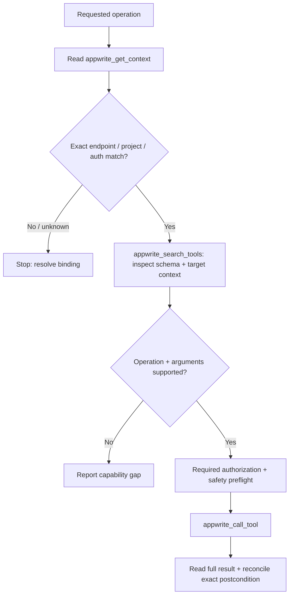

# MCP Servers

## Contract

- Agent operations = MCP only ([SKILL.md](../SKILL.md) invariant 1). SDK examples elsewhere describe application implementation, not an alternate operational path.
- Server choice = deployed endpoint, never preference; wrong choice authenticates against the wrong instance and reads nothing.
- Cloud project (`cloud.appwrite.io` or `*.cloud.appwrite.io`) = hosted remote server `https://mcp.appwrite.io/`, HTTP transport + OAuth, no key stored.
- Self-hosted instance (any other domain) = local stdio server `uvx mcp-server-appwrite` + API key. The hosted server authenticates against Appwrite Cloud only and can never reach a self-hosted instance.
- API key never appears in a committed harness config; one repository launcher owns secret loading.
- MCP access stays within the authenticated OAuth grant or API-key scopes; live mutations follow [production-migrations](production-migrations.md), and subject erasure follows [destructive-erasure](destructive-erasure.md).

## Operations



- Bind the intended endpoint + project ID + authentication mode before reads or writes. Context mismatch or unknown target = stop; a project name alone is insufficient.
- Hosted tools declare `context=console|organization|project`; pass the selected top-level `project_id` or `organization_id` required by that tool. Self-hosted stdio stays bound to the launcher's endpoint/project/API key.
- Search the connected server's catalog before constructing arguments; server/version/auth profiles differ. Inspect required fields, write effects, scope, pagination, and result shape rather than guessing names or parameters.
- Mutating calls require `confirm_write=true` only after the requested action is authorized and its safety preflight passes. The flag acknowledges a write; it grants no authorization and proves no backup, target, or outcome.
- Disabling a project service/protocol affects every consumer; inventory them and authorize that destructive scope before the call.
- Read any returned MCP result resource in full; a preview or truncated list is not complete evidence. Require every protected field; omitted field = unknown, never empty. Keep secret-bearing resources out of the transcript.
- Failure or timeout after a write → read the exact resource/transaction/deployment state before any retry. Preserve the primary failure when recovery also fails.

## Capability + Credential Boundaries

- Hosted OAuth includes console/organization/project operations permitted by its grant. Self-hosted API-key stdio exposes project-key-compatible operations only; Projects/key management and other console administration are unavailable there.
- Missing tool, unsupported field, insufficient scope, unavailable full result, or incompatible deployed API → report the exact blocker; [SKILL.md](../SKILL.md) invariant 1 allows no fallback.
- Hosted uploads cannot read local paths; use only a supported bounded inline input or already-authorized URL. Stdio can read local files. Never publish private source or secrets merely to obtain an upload URL; unavailable safe transfer = capability gap.
- API-key scopes come from every real consumer call, never a full-scope default. `401` → verify endpoint/project/credential; `403` → compare required scopes with the authorized operation before widening access.
- Self-hosted initial key creation requires the user's Appwrite Console action; do not bypass the missing MCP control-plane capability.
- Rotation requires exact consumer variable + secret-store names, a protected transfer path, and actual consumer proof with the candidate key. A tool that returns the new key into the transcript is not a protected transfer path: stop and report the gap. Metadata alone never proves consumer secret delivery; retire the old key only after authorized cutover + new-key acceptance proof.
- Secret values never enter tool arguments visible in the transcript, logs, tracked files, or diagnostics. Unexpected exposure → stop, report the affected credential without repeating its value, and coordinate revocation/replacement.

## Self-Hosted Launcher

Prerequisite = `uv` installed (`uvx` on PATH) + API key with the scopes every intended tool needs.

1. Create one tracked executable repository launcher (`scripts/appwrite-mcp`).
2. Resolve the repository root from the script's own path; MCP clients do not guarantee the launch working directory.
3. Source the repository's existing gitignored Appwrite env file; keep one secret owner.
4. Fail before exec with a stderr message when the env file or any of `APPWRITE_ENDPOINT` + `APPWRITE_PROJECT_ID` + `APPWRITE_API_KEY` is missing.
5. End with `exec uvx mcp-server-appwrite "$@"` so the ambient environment passes through.
6. Read `uvx mcp-server-appwrite --help` before adding arguments. Published docs list per-service flags (`--tablesdb`, `--users`, `--storage`); current releases reject them and register services automatically.

```bash
#!/usr/bin/env bash
set -euo pipefail

repo_root="$(cd "$(dirname "${BASH_SOURCE[0]}")/.." && pwd -P)"
env_file="${APPWRITE_ENV_FILE:-$repo_root/.env.appwrite.local}"

[[ -f "$env_file" ]] || { echo "appwrite-mcp: missing $env_file" >&2; exit 1; }

set -a
# shellcheck source=/dev/null
source "$env_file"
set +a

for name in APPWRITE_ENDPOINT APPWRITE_PROJECT_ID APPWRITE_API_KEY; do
  [[ -n "${!name:-}" ]] || { echo "appwrite-mcp: $name is not set in $env_file" >&2; exit 1; }
done

exec uvx mcp-server-appwrite "$@"
```

## Harness Wiring

Claude and Codex each point to the launcher; on Cloud each carries the remote URL instead.

| Harness | Committed file | Shape |
|---|---|---|
| Claude Code | `.mcp.json` | `mcpServers.appwrite` = `"type": "stdio"` + `"command": "./scripts/appwrite-mcp"` |
| Codex | `.codex/config.toml` | `[mcp_servers.appwrite]` + `command = "./scripts/appwrite-mcp"`; loads only when the repository is trusted, and overrides a same-named global server |

- Committed configs carry relative paths only; absolute home paths, emails, project IDs, and keys stay out.
- Codex trust is per machine: the repository path needs `[projects."<absolute-repo>"] trust_level = "trusted"` in `~/.codex/config.toml`, written by answering yes on first run in that directory. Untrusted repository = project file silently ignored.
- `codex mcp add` writes the global `~/.codex/config.toml` and leaks one repository's server into every other repository; prefer the project file and keep the global command only as a documented fallback.
- `codex mcp list` and `codex doctor` read the merged view from the current directory; run them inside the repository, and treat a server missing there as untrusted rather than unconfigured.
- Repository copies ignored files into new worktrees (for example `.worktreeinclude`) → the Appwrite env file belongs on that list; tracked configs travel with the branch already.
- Hosted server on a host without a browser → `claude mcp login appwrite --no-browser`, then paste the full localhost callback URL back into the prompt.

## Surface

- Exposed tools = `appwrite_get_context` + `appwrite_search_tools` + `appwrite_call_tool`; the full service catalog is hidden behind search and call rather than registered individually.

## Documentation Search

- Built-in `appwrite_search_docs` activates only when the bundled index and `OPENAI_API_KEY` are both present; startup logs state which branch applied.
- The index ships inside the package; the key buys ranking, not content.
- Embeddings are bound to OpenAI `text-embedding-3-small`, so no other provider substitutes; vectors from a different model rank as noise.
- Key-free replacement = Appwrite's own machine-readable manual, preferred default:

| Fact | Value |
|---|---|
| Feed | `https://appwrite.io/llms-full.txt` (index-only variant `llms.txt`; single page = append `.md` to its URL) |
| Page split | line `## <Title>` → blank line → line `URL: https://appwrite.io/...` |
| Blocked default | Python `urllib` default User-Agent returns `403`; send an identifying User-Agent |
| Cache | gitignored repository folder, re-download when older than 7 days |
| Ranking | weight title + URL path segments above body; demote `blog/` below guides |
| Cleanup | strip `` template tags when printing a page |

## Proof

1. Name the branch first: print the deployed endpoint and state Cloud or self-hosted before writing any config.
2. Self-hosted: drive the launcher over stdio by hand: send `initialize`, confirm `serverInfo` returns and the startup log names the deployed endpoint. Send `tools/list` and report the actual tool names.
3. Cloud: authenticate the hosted server (Claude Code `/mcp` → appwrite → **Authenticate**, or `claude mcp login appwrite --no-browser`; Codex `codex mcp login appwrite`) → call read-only `appwrite_get_context` → it lists the target project ID, and that project's `region` = the endpoint's `<REGION>` in `https://<REGION>.cloud.appwrite.io/v1`. Report the actual tool names.
4. Confirm registration per harness (`claude mcp list`, `codex mcp list` from inside the repository); declare which harnesses were verified live and which were configured from documentation only.
5. Prove Codex isolation: the server resolves inside the repository and `codex mcp get appwrite` fails in an unrelated repository.
6. Scan every new file for secrets before commit.
7. `PASS` = branch proven + stdio handshake (self-hosted) or authenticated context read (Cloud) against the deployed endpoint + per-harness registration stated + no secret in a committed file.

## Sources

- Hosted OAuth + self-hosted routing: <https://appwrite.io/docs/tooling/ai/mcp-servers>
- Authentication-aware catalog + target context: <https://github.com/appwrite/mcp/blob/main/docs/tool-surface.md>
- Self-hosted control-plane limits: <https://github.com/appwrite/mcp/blob/main/docs/self-hosted.md>
- Upload/result handling: <https://github.com/appwrite/mcp/blob/main/src/mcp_server_appwrite/server.py>
